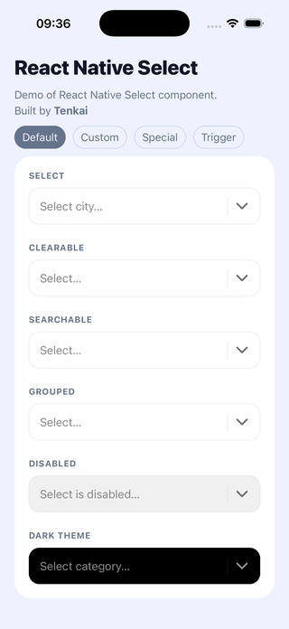
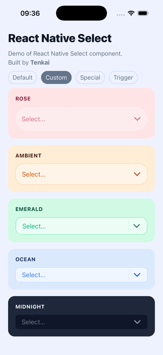
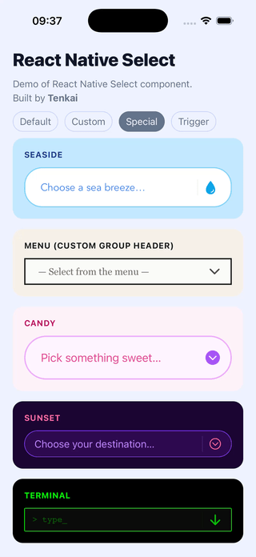
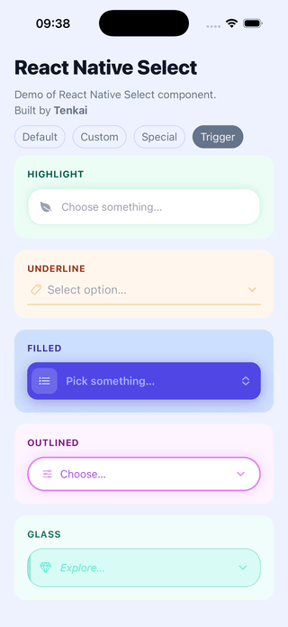

# React Native Select

 


A fully customizable select/dropdown for React Native. Inspired by [`react-select`](https://react-select.com/), built for native environments.

<!-- <p align="center" style="white-space: nowrap;">
  
  
  
  
</p> -->
<p align="center" style="white-space: nowrap;">
  
  
  
  
</p>

<!-- <p align="center">
  
  
  
  
</p> -->
<p align="center">
  
  
  
  
</p>
<!-- <div style="overflow-x: auto;">
  <table style="border-collapse: separate; border-spacing: 1px 0;">
    <tr>
      <td style="padding: 0;"></td>
      <td style="padding: 0;"></td>
      <td style="padding: 0;"></td>
      <td style="padding: 0;"></td>
    </tr>
  </table>
</div> -->
<!-- <table>
  <tr>
    <td></td>
    <td></td>
    <td></td>
    <td></td>
  </tr>
</table> -->

✨ Single select · search · clear · groups · disabled · dark theme  
🎨 Custom colors, sizes, typography, icons, trigger, group header  
📱 Native-first — keyboard, modal, layout handled correctly  
⚡ Works with Expo & bare React Native

**[→ See all examples in the repository](https://github.com/tenkaipl/react-native-select/tree/main/examples/DemoScreen.js)**

---

## Quick example

```jsx
import React, { useState } from 'react';
import ReactNativeSelect from '@tenkai/react-native-select';

const OPTIONS = [
  { value: 'apple',  label: 'Apple' },
  { value: 'banana', label: 'Banana' },
  { value: 'cherry', label: 'Cherry' },
];

export default function App() {
  const [value, setValue] = useState(null);

  return (
    <ReactNativeSelect
      options={OPTIONS}
      value={value}
      onChange={(item) => setValue(item.value)}
      placeholder="Select a fruit..."
      searchable
      clearable
    />
  );
}
```

---

## Installation

```bash
npm install @tenkai/react-native-select @expo/vector-icons react-native-safe-area-context
```

### SafeAreaProvider (required)

Wrap your app root with `SafeAreaProvider`. Without it, modal layout may be off on notched devices.

```jsx
import { SafeAreaProvider } from 'react-native-safe-area-context';

export default function App() {
  return (
    <SafeAreaProvider>
      {/* your app */}
    </SafeAreaProvider>
  );
}
```

---

## ⚠️ ScrollView compatibility

If you use this component inside a `ScrollView`, `FlatList`, or `SectionList`, add `keyboardShouldPersistTaps="handled"` to the parent:

```jsx
<ScrollView keyboardShouldPersistTaps="handled">
  <ReactNativeSelect ... />
</ScrollView>
```

Without it, the first tap on an option dismisses the keyboard instead of selecting — you'd need a second tap. This is caused by how React Native's touch responder system works: the parent `ScrollView` intercepts the first tap even when the select renders inside a `Modal`.

---

## Usage

### Basic

Same as the Quick example above. `onChange` receives the full option object `{ value, label }` — store whichever part you need.

### With groups

```jsx
const OPTIONS = [
  { type: 'group',  label: 'Fruits' },
  { type: 'option', value: 'apple',  label: 'Apple' },
  { type: 'option', value: 'banana', label: 'Banana' },
  { type: 'group',  label: 'Vegetables' },
  { type: 'option', value: 'carrot',   label: 'Carrot' },
  { type: 'option', value: 'broccoli', label: 'Broccoli' },
];
```

During search, group headers are shown only when at least one of their options matches the query.

### `flattenGroupedOptions` helper

If your data comes from an API in nested format, use the built-in helper:

```jsx
import ReactNativeSelect, { flattenGroupedOptions } from '@tenkai/react-native-select';

const GROUPED_DATA = [
  {
    label: 'Fruits',
    options: [
      { value: 'apple',  label: 'Apple' },
      { value: 'banana', label: 'Banana' },
    ],
  },
  {
    label: 'Vegetables',
    options: [{ value: 'carrot', label: 'Carrot' }],
  },
];

// Static data — flatten once, outside the component
const OPTIONS = flattenGroupedOptions(GROUPED_DATA);

// Dynamic data (e.g. fetched) — use useMemo
// const options = useMemo(() => flattenGroupedOptions(data), [data]);
```

---

## Options format

```ts
// Regular option (selectable)
{ type?: 'option', value: string | number, label: string }

// Group header (non-selectable, skipped during search matching)
{ type: 'group', label: string }
```

`type` is optional for regular options — plain `{ value, label }` objects work as-is.

---

## Props

### Data

| Prop | Type | Default | Description |
|------|------|---------|-------------|
| `options` | `Option[]` | `[]` | List of options. See [Options format](#options-format). |
| `value` | `string \| number \| null` | — | Currently selected value (not the full object). |
| `onChange` | `(item: Option) => void` | — | Called when the user selects an option. Receives the full `{ value, label }` object. |
| `placeholder` | `string` | `''` | Text shown in the trigger when nothing is selected. |
| `placeholderText` | `string` | `'No results'` | Text shown in the list when the filtered result is empty. |

### Behavior

| Prop | Type | Default | Description |
|------|------|---------|-------------|
| `searchable` | `boolean` | `false` | Enables the search input inside the modal. |
| `clearable` | `boolean` | `false` | Shows a clear (×) button when a value is selected or search text is present. |
| `disabled` | `boolean` | `false` | Disables the trigger and prevents the dropdown from opening. |
| `autoFocus` | `boolean` | `true` | Focuses the search input when the modal opens. On Android handled via `onShow` + `setTimeout`. |
| `animationType` | `'fade' \| 'slide' \| 'none'` | `'fade'` | Animation used by the underlying `<Modal>`. |
| `transparent` | `boolean` | `true` | Controls the `transparent` prop of `<Modal>`. |
| `cursorColor` | `string \| null` | `null` | Cursor color of the search `TextInput`. |
| `pressedOpacity` | `number` | `0.6` | Opacity applied to all `Pressable` elements when pressed. |
| `hideDivider` | `boolean` | `false` | Hides the vertical separator between action buttons and the chevron. |
| `hideItemSeparator` | `boolean` | `false` | Hides horizontal separators between list items. |
| `itemLabelSingleLine` | `boolean` | `false` | Renders option labels as a single line with ellipsis instead of wrapping. |
| `autoCorrect` | `boolean` | `false` | Controls `autoCorrect` on the search `TextInput`. |
| `spellCheck` | `boolean` | `false` | Controls `spellCheck` on the search `TextInput`. Note: when enabled, the first tap on the clear button may not register. |

### Render props

| Prop | Type | Description |
|------|------|-------------|
| `renderTrigger` | `({ onPress, disabled, selectedLabel, hasValue, onClear }) => ReactNode` | Fully replaces the default trigger button. |
| `renderGroupHeader` | `({ item }) => ReactNode` | Replaces the default group header row. |

### Design tokens

| Prop | Type | Default | Description |
|------|------|---------|-------------|
| `theme` | `'light' \| 'dark'` | `'light'` | Base color preset. |
| `colors` | `Partial<Colors>` | `{}` | Overrides individual colors. Merged with the active theme. See [Colors](#colors). |
| `sizes` | `Partial<Sizes>` | `{}` | Overrides dimensions. See [Sizes](#sizes). |
| `typography` | `Partial<Typography>` | `{}` | Overrides font settings. See [Typography](#typography). |
| `icons` | `Partial<Icons>` | `{}` | Overrides icon names (Ionicons). See [Icons](#icons). |

### Style overrides

| Prop | Type | Description |
|------|------|-------------|
| `triggerStyle` | `ViewStyle` | Additive style applied to the trigger container. |
| `dropdownStyle` | `ViewStyle` | Additive style applied to the dropdown container. |
| `itemStyle` | `ViewStyle` | Additive style applied to each option row. |
| `groupHeaderStyle` | `ViewStyle` | Additive style applied to each group header row. |

> ⚠️ These are **additive overrides** — they do not replace internal styles. Overriding `height`, `flex`, `overflow`, or positioning properties may break the layout.

---

## Colors

| Key | Description |
|-----|-------------|
| `primary` | Background of the trigger and dropdown. |
| `secondary` | Color of the chevron and close icons. |
| `colorTextPrimary` | Color of the selected label and option text. |
| `colorTextSecondary` | Color of the placeholder and group header text. |
| `lines` | Color of separators. Used as `borderColor` if `border` is not set. |
| `border` | *(optional)* Explicit border color. Falls back to `lines` if omitted. |
| `disabled` | Background of the trigger when `disabled={true}`. |
| `shadow` | `shadowColor` / `elevation` color. |
| `selected` | Background of the selected option row. |

---

## Sizes

| Key | Default | Description |
|-----|---------|-------------|
| `itemHeight` | `50` | Height of each row (trigger, option rows, search bar). Clamped between `35`–`70`. |
| `maxListWidth` | `600` | Maximum width of the dropdown. |
| `maxListHeight` | `undefined` | Maximum height of the dropdown. |
| `separatorWidth` | `hairlineWidth` | Height of horizontal separators. |
| `borderRadius` | `15` | Border radius of the trigger and dropdown. |
| `borderWidth` | `hairlineWidth` | Border width of the trigger and dropdown. |
| `iconSize` | `24` | Size of the chevron and close icons. |
| `inputPaddingLeft` | `15` | Left padding of the text / search input. |
| `inputPaddingRight` | `5` | Right padding inside the trigger and search bar. |
| `itemPaddingHorizontal` | `15` | Horizontal padding of option and group header rows. |

`itemHeight` is clamped between `35` and `70`. The lower bound exists because Android breaks the `TextInput` layout in the search bar at smaller heights.

---

## Typography

| Key | Default | Description |
|-----|---------|-------------|
| `fontSize` | `16` | Font size for option labels, placeholder, and group header text. |
| `fontFamily` | `undefined` | Font family applied to all text inside the component. |

---

## Icons

Icon names from [`@expo/vector-icons` Ionicons](https://icons.expo.fyi/).

| Key | Default | Description |
|-----|---------|-------------|
| `chevron` | `'chevron-down'` | Icon on the right side of the trigger and modal header. |
| `close` | `'close'` | Icon for the clear button. |

---

## Roadmap

- Multi-select
- Async options (loadOptions)
- Creatable (add a new option not in the list)
- Fixed options
- RTL – Support for right-to-left languages
- Colored list items
- Inline autocomplete (ghost text)
- onSubmit – select the best match on Enter / search submit
- Keyboard navigation (for web)
- Animations during filtering
- More efficient list rendering for large option sets (maybe using FlashList)

---

## Comparison with react-select

If you're coming from a web project, here's where things stand:

| Feature | react-select | React Native Select |
|---------|-------------|---------------------|
| Single select | ✅ | ✅ |
| Searchable | ✅ | ✅ |
| Clearable | ✅ | ✅ |
| Disabled state | ✅ | ✅ |
| Option groups | ✅ | ✅ |
| Multi-select | ✅ | ❌ planned |
| Async options | ✅ | ❌ planned |
| Creatable | ✅ | ❌ planned |

---

## Compatibility & status

| Platform | Supported |
|----------|-----------|
| iOS      | ✅ |
| Android  | ✅ |
| Web      | ✅ |
| Expo     | ✅ |

This is **v1**. The core API and behavior are stable; some edge cases and advanced features are still being refined.

---

## Feedback

If something doesn't work as expected — especially on specific screens (modals, lists, keyboard-heavy views) — please open an issue. Real-world edge cases are exactly what this library is designed to solve.

---

## License

MIT — see [LICENSE](./LICENSE).

---

## Keywords
- react-native
- expo
- react native select
- react native dropdown
- custom select
- custom dropdown
- headless ui
- react native picker alternative

---

Built by [Tenkai](https://www.tenkai.pl)
